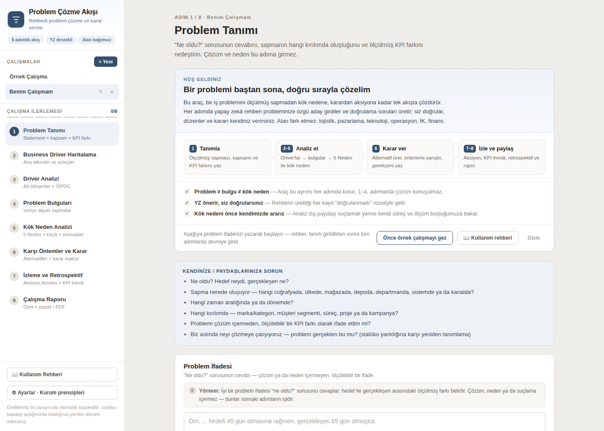
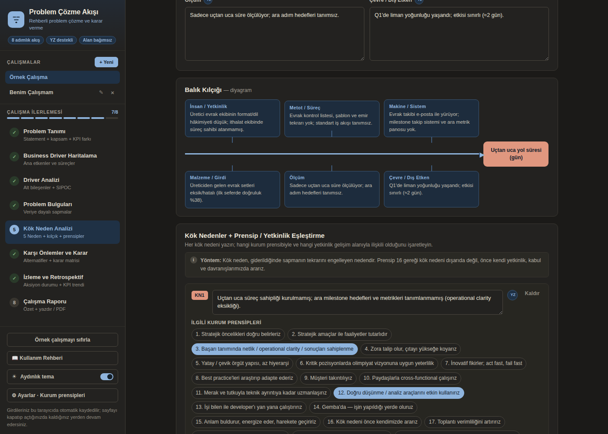

# ProblemLab

**Bir iş problemini ölçülmüş sapmadan kök nedene, karardan aksiyona kadar tek akışta çözdüren,
yapay zekâ destekli çalışma aracı.**

Amaç yalnızca bir formu doldurtmak değil; doğru düşünme tekniklerini gerçek bir problem üzerinde
uygulatmak. Araç alan bağımsızdır — lojistik, pazarlama, teknoloji, operasyon, İK, finans.
Tarayıcıdan açılır, kurulum ve kullanıcı hesabı gerektirmez; girdiler tarayıcıda saklanır.

🔗 **Canlı:** https://problem-solving-tool.netlify.app · 📖 Uygulama içinden **Kullanım Rehberi**


Boş bir çalışmada ilk adım, akışın dört evresini ve temel ilkeleri anlatan bir karşılama
kartıyla açılır; kenar çubuğu aktif çalışmanın kaç adımının dolduğunu gösterir.



---

## İçindekiler

- [Ne yapar](#ne-yapar)
- [8 adımlık akış](#8-adımlık-akış)
- [Yapay zekâ katmanı](#yapay-zekâ-katmanı)
- [Düşünme yöntemleri ve bilişsel yanılgılar](#düşünme-yöntemleri-ve-bilişsel-yanılgılar)
- [Hızlı başlangıç](#hızlı-başlangıç)
- [Netlify yayını](#netlify-yayını)
- [Ayarlar](#ayarlar)
- [Mimari](#mimari)
- [Veri modeli](#veri-modeli)
- [Geliştirirken bilinmesi gerekenler](#geliştirirken-bilinmesi-gerekenler)
- [Bilinen sınırlar](#bilinen-sınırlar)

---

## Ne yapar

Kurumlarda kararlar çoğu zaman veri eksikliğinden değil **yöntem** eksikliğinden zayıflar:
problem ile bulgu, bulgu ile kök neden birbirine karışır; analiz bitmeden çözüm konuşulur;
kök neden dış paydaşta aranır. Bu araç akışı disipline eder ve her adımda doğru soruyu sordurur.

| | |
| --- | --- |
| **Metodolojik disiplin** | Problem ≠ bulgu ≠ kök neden ayrımı her adımda korunur; 1–4. adımlarda çözüm konuşulmaz. |
| **Kurum prensipleriyle entegre** | Kök nedenler, düzenlenebilir 20 kurum prensibiyle ve yetkinlik gelişim alanlarıyla eşleştirilir. |
| **YZ önerir, kullanıcı doğrular** | Rehberin ürettiği her kayıt "doğrulanmadı" rozetiyle işaretlenir; doğrulanmadan ilerlerken uyarı çıkar. |
| **Düşünme denetimi** | Düşünme yöntemi ↔ bilişsel yanılgı eşleşmesi, karar öncesi üç soru ve yanılgı taraması. |
| **Döngüyü kapatır** | Aksiyon durumu + KPI trendi; hedefe kapanmıyorsa analize geri döndürür (PDCA). |
| **Paylaşılabilir çıktı** | Tek sayfa rapor: yönetici özeti, seçilebilir bölümler, yazdır/PDF. |
| **Aydınlık / karanlık tema** | İlk açılışta sistem tercihini izler, kenar çubuğundaki anahtarla değiştirilir; yazdırma her zaman açık temadır. |
| **Paylaşım linki** | Çalışma sıkıştırılıp URL'ye gömülür (sunucusuz); alıcı salt-okunur raporu görür, isterse kopyalayıp düzenler. |
| **Mobil uyumlu** | Dar ekranda kenar çubuğu çekmeceye dönüşür; Gemba'da telefondan kullanılabilir. |

Birden çok çalışma (vaka) aynı anda yürütülebilir; silinen çalışma geri alınabilir; tüm veri
JSON olarak dışa/içe aktarılabilir.

## 8 adımlık akış

| # | Adım | İçerik |
| --- | --- | --- |
| 1 | **Problem Tanımı** | Ölçülebilir ifade + boyutlar + KPI farkı; VAR/YOK belirtimi (Kepner-Tregoe) + değişiklik analizi; canlı kalite kontrol çipleri; referans ekleme (not/link/PDF/DOCX) |
| 2 | **Business Driver Haritalama** | MECE driver listesi + otomatik çizilen driver haritası |
| 3 | **Driver Analizi** | Alt bileşen analizi + SIPOC satırları |
| 4 | **Problem Bulguları** | Ölçülmüş sapmalar + kanıt kaynağı + sapmaya katkı → Pareto önceliklendirme |
| 5 | **Kök Neden Analizi** | 5 Neden zinciri, balık kılçığı (diyagramıyla), kök neden ↔ prensip ↔ yetkinlik eşleştirmesi |
| 6 | **Karşı Önlemler ve Karar** | Geçici önlem (8D-D3), alternatifler (düşünme yöntemiyle), ağırlıklı karar matrisi, karar öncesi düşünme kontrolü, karar, pre-mortem (Klein), aksiyon planı (etki/efor önceliklendirme) |
| 7 | **İzleme ve Retrospektif** | Aksiyon durumu, KPI trend grafiği, dört soruluk retrospektif |
| 8 | **Çalışma Raporu** | Yönetici özeti, tutarlılık denetimi, karar matrisi tablosu + KPI trend grafiği, bölüm seçimi, yazdır/PDF, paylaşım linki |


## Yapay zekâ katmanı

Tüm akışlar `buildSystem(step, case)` sistem talimatını paylaşır: adımın odağı + çalışmanın
tamamı (JSON) + ayarlardan gelen seviye/üslup/derinlik ekleri + kullanıcı referansları +
yanılgı farkındalığı kuralı.

| Akış | Nerede | Ne yapar |
| --- | --- | --- |
| **Rehber (coach)** | Adım 1–6 | Adıma girince form boşsa kendiliğinden çalışır; katı JSON şemasıyla aday girdiler üretir, "Forma ekle" ile forma işlenir |
| **Karar önerisi** | Adım 6 | Alternatif, kriter ve matris puanlarını değerlendirip gerekçeli karar taslağı verir |
| **Aksiyon önerisi** | Adım 6 | Karara ve kök nedenlere dayalı, etki/efor puanlı aksiyonlar (B2, KN1 atıflarıyla) |
| **Yanılgı taraması** | Adım 6 | Vakayı 11 maddelik yanılgı kataloğuna karşı tarar; her tespit kullanıcının kendi cümlesinden alıntıyla kanıtlanır |
| **Pre-mortem** | Adım 6 | "Karar uygulandı ve başarısız oldu" kurgusuyla 4-5 senaryo + erken sinyal + önleyici tedbir; tedbirler plana eklenir |
| **Tutarlılık denetimi** | Adım 8 | Problem → bulgu → kök neden → karar → aksiyon zincirinin nerede koptuğunu raporlar |
| **Yönetici özeti** | Adım 8 | Rapora 4–6 cümlelik özet ekler |
| **Asistan sohbeti** | Her adım | O adımın uzmanı rolünde serbest sohbet; alan başına `YZ` yardım düğmeleri |

**Rehberlik seviyesi** çıktının karakterini değiştirir: *Öğreten* modda YZ hiç öneri vermez,
yalnızca Sokratik sorular sorar; *Dengeli* hipotez + doğrulama soruları üretir; *Hızlandıran*
doğrudan kullanılabilir taslaklar yazar.

## Düşünme yöntemleri ve bilişsel yanılgılar

`src/lib/thinking.js`, kurum dokümanlarından türetilmiş bilgi tabanıdır: her düşünme yöntemi
belirli bir yanılgının panzehiridir.

| Düşünme yöntemi | Karşı çalıştığı yanılgı |
| --- | --- |
| Eleştirel düşünce | Onaylama yanlılığı |
| İlk ilkeler düşüncesi | Statüko yanlılığı & batık maliyet |
| Tasarım odaklı düşünce | Temsil yanlılığı |
| Yanal düşünce | Aşırı güven yanlılığı |
| İkinci düzey düşünce | Kısa vadecilik & sonuç yanlılığı |
| Sistem düşüncesi | Mevcudiyet yanlılığı & aşırı basitleştirme |
| Algoritmik düşünce | Çapa etkisi & sezgisel kısayollar |

Uygulamadaki karşılıkları: alternatife yöntem seçilince o yöntemin **5 ekip sorusu** açılır;
Adım 6'daki **Karar Öncesi Düşünme Kontrolü** üç soruyu sordurur (neyi varsayıyorum / başka
hangi açıklama mümkün / bedelini kim ve ne zaman ödeyecek), yanılgı taramasını çalıştırır ve
düşünme farkındalığı + toplantı mikro müdahaleleri + lider davranışlarını hatırlatır. Günlük
alışkanlıklar ilgili adımlara soru olarak gömülüdür (Adım 1 problemi yeniden tanımlama,
Adım 4 "bence" yerine ölçülen veri, Adım 7 karar sonrası refleksiyon).


## Hızlı başlangıç

```bash
npm install
npm run dev        # http://localhost:5173
npm run build      # dist/
npm run preview    # üretim çıktısını yerelde dener
npm test           # hesaplama katmanının otomatik testleri (node --test)
```

> `npm run dev` ile "Otomatik" YZ modu çalışmaz (Netlify uçları yok). Yerelde denemek için
> `netlify dev` kullanın ya da Ayarlar → YZ Sağlayıcı'dan kendi API anahtarınızı girin.

Gereksinim: Node 18+.

## Netlify yayını

`netlify.toml` hazırdır: `npm run build` → `dist` yayınlanır, `netlify/functions` ve
`netlify/edge-functions` otomatik kurulur.

| Ortam değişkeni | Zorunlu | Açıklama |
| --- | --- | --- |
| `MINIMAX_API_KEY` | evet | "Otomatik" modda kullanılan anahtar; tarayıcıya hiç inmez |
| `MINIMAX_MODEL` | hayır | varsayılan `MiniMax-M3` |
| `MINIMAX_BASE_URL` | hayır | varsayılan MiniMax chat/completions ucu |

Sunucu uçları:

- **`netlify/edge-functions/ai.js` → `/api/ai`** — asıl köprü. Sağlayıcıyı `stream: true` ile
  çağırıp SSE akışını olduğu gibi iletir; ilk bayt saniyeler içinde gittiği için serverless
  fonksiyonların 10 sn'lik senkron sınırı devreye girmez.
- **`netlify/functions/ai.js`** — akışsız yedek köprü. İstemci önce `/api/ai`'yi dener,
  ulaşılamazsa buraya düşer. Sağlayıcıyı 9 sn'de keserek gövdesiz 502 yerine anlaşılır bir
  504 mesajı döndürür.
- **`netlify/functions/fetch-ref.js`** — referans linki okuyucu (SSRF korumalı, 8 sn timeout,
  ilk 20.000 karakter).

## Ayarlar

Kenar çubuğundaki **⚙ Ayarlar** panelinden:

- **YZ sağlayıcı** — `Otomatik` (sunucudaki anahtar) · `MiniMax` · `OpenAI` · `Anthropic` ·
  **`Özel / Yerel`**: OpenAI uyumlu herhangi bir uç nokta. Hazır profiller: OpenRouter, Ollama,
  LM Studio, Azure OpenAI. Kimlik başlığı adı/ön eki ve ek başlıklar ayarlanabilir; anahtar boşsa
  hiç yetki başlığı gönderilmez (yerel sunucular). *Uç noktanın CORS izni vermesi gerekir;
  Ollama için `OLLAMA_ORIGINS=*`.*
- **Model üretim ayarları** — model adı (Otomatik modda da geçerli), **düşünme eforu**,
  **analiz derinliği**, **yaratıcılık** (temperature) ve `top_p`.

  **Düşünme eforu (reasoning)** düşünen modellerde — MiniMax M3 ve benzerleri — modelin
  cevaptan önce akıl yürütüp yürütmeyeceğini belirler; sağlayıcıya `thinking: {type: …}`
  olarak gider. M3 yalnızca iki değer kabul eder: `Kapalı` (disabled) en hızlı ve ucuz;
  `Açık` (adaptive, varsayılan) modelin gerektiğinde akıl yürütmesine izin verir.
  Desteklemeyen modeller alanı yok sayar; eski uçta (chatcompletion_v2) hiç gönderilmez.

  Düşünme tokenları da bütçeden harcandığı için etkin bütçe iki çarpanın çarpımıdır:
  derinlik (standart ×1 · geniş ×1,6 · derin ×2,5) × düşünme (kapalı ×1 · açık ×1,8),
  üst sınır 60.000 token. Ayarlar ekranı seçime göre etkin bütçeyi gösterir.

  > Düşünen modeller düşünceyi ya ayrı bir alanda (`reasoning_content`) ya da yanıtın içine
  > `<think>…</think>` olarak gömerek döndürür. Uygulama isteğe `reasoning_split: true` ekler,
  > akışta düşünce delta'larını yok sayar ve her sağlayıcı yolunda `stripThinking()` ile
  > kalıntı blokları temizler — aksi hâlde rehber kartlarının JSON ayrıştırması bozulurdu.
  > Bu davranış `tests/ai.test.mjs` ile test edilir.
- **Rehber ayarları** — rehberlik seviyesi, otomatik öneri, alan/sektör bağlamı, yanıt uzunluğu,
  ton, eleştirellik.
- **Kurum prensipleri** — 20 varsayılan prensip düzenlenebilir/silinebilir; kök neden
  eşleştirmeleri prensip silindiğinde otomatik güncellenir.
- **Veri yedekleme** — tüm çalışmaları JSON dışa/içe aktarma.

> Kendi API anahtarınız yalnızca tarayıcınızda saklanır ve doğrudan seçtiğiniz sağlayıcıya
> gider; hiçbir sunucuda tutulmaz. Abonelik hesapları (Claude Pro/Max, ChatGPT Plus) üçüncü
> taraf uygulamalara açılmadığı için desteklenmez.

## Mimari

React 18 + Vite. Durum yönetimi tek bir Context store'da; harici state kütüphanesi yok.

```
src/
  App.jsx                  sayfa iskeleti, adım geçişleri, doğrulama uyarıları
  lib/
    store.jsx              tek state ağacı + localStorage + tüm YZ akışları (Context)
    ai.js                  sağlayıcı katmanı (complete) + sistem talimatı ve görev şemaları
    thinking.js            düşünme yöntemi ↔ yanılgı bilgi tabanı, soru setleri
    defaults.js            kurum prensipleri, boş/örnek çalışma, adım metinleri
    derive.js              KPI farkı, ifade kalite kontrolü, karar matrisi, trend, driver haritası
  components/              Sidebar · CoachPanel · AssistantChat · SettingsModal · ThinkingCheck
  steps/                   Step1…Step8
  ui/primitives.jsx        tasarım token'ları ve ortak öğeler (hover/focus davranışı dahil)
public/rehber.html         yazdırılabilir kullanım rehberi (A4)
netlify/                   edge-functions/ai.js · functions/ai.js · functions/fetch-ref.js
docs/screenshots/          README görselleri
project/ · chats/          kaynak prototip ve tasarım oturumu dökümleri (referans)
```

Stil, prototipteki inline stillerle birebir taşınmıştır; `ui/primitives.jsx` içindeki `S`
nesnesi tasarım token'larını (kart, girdi, düğme, rozet) tek yerde tutar. Hover davranışı
`HButton`/`HA`/`HDiv` bileşenlerinde, focus davranışı `index.css`'teki `.pcx-field`
sınıflarındadır.

## Veri modeli

Tüm durum tek ağaçta tutulur ve her değişimde `localStorage` anahtarı **`pcx_workbook_v1`**
altına yazılır (prototiple aynı şema — eski kullanıcı verisi olduğu gibi açılır).

```
{ activeCase, step (1-8), trash{key,data,name}|null,
  principles: string[],
  reportCfg: { company, sections{tanim,driver,analiz,bulgu,kok,karar,izleme,dusunme,referans} },
  aiSettings: { provider:'auto'|'minimax'|'openai'|'anthropic'|'ozel',
                apiKey, model, baseUrl, headerName, headerPrefix, extraHeaders,
                level:'ogreten'|'dengeli'|'hizli', auto, context,
                length, tone, critic, temperature, topP,
                depth:'standart'|'genis'|'derin' },
  cases: { <id>: CASE } }

CASE = { name,
  problem{statement,geo,time,brand,kpiName,target,actual,
          direction:'dusuk'|'yuksek'|'aralik', unit, targetHigh},
  drivers[{name,note,src?,verified?}], driverAnalysis[…], sipoc[{s,i,p,o,c}],
  findings[{text,evidence,share,…}],          // share = KPI ile AYNI birimde sapma katkısı
  whys[5], whyChains[{label,whys[5]}],        // dallanabilen 5 Neden
  fishbone{insan,metot,sistem,girdi,olcum,cevre},
  rootCauses[{text,principles[int],competency,
              status:'hipotez'|'destekleniyor'|'test-planlandi'|'test-edildi'|'dogrulandi'|'elendi',
              findings[int],                  // hangi bulguları açıklıyor (B indeksleri)
              evidence, explainsSpec, testPlan, testResult, kpiExpected}],
  alternatives[{name,method,note}],
  criteria[{name,weight,yon:'yuksek'|'dusuk',d1,d3,d5,source}],
  scores{'ai_ci':val}, decision{choice,rationale}, thinking{assume,alt,cost},
  spec{nerede,zaman,kirilim,buyukluk,degisiklik}, containment{action,owner,until,removed},
  actions[{text,owner,startDate,dueDate,due,status,etki,efor,
           rcIdx,findingIdx,successCriteria,evidence,delayReason,priority}],
  tracking[{label,value}], retro{valid,worked,process,lessons},
  references[{id,title,type,url,text,summary,…}],
  ai{step:[msg]}, coach{step:{status,intro,items,questions}},
  decisionCoach{…}, actionCoach{…}, biasScan{…}, premortem{…}, audit{…}, report{…} }
```

Üst düzeyde ayrıca `lastSaved` ve `lastBackup` (ISO tarih) tutulur; Ayarlar bunları gösterir
ve bir haftadan eski yedek için hatırlatma çıkarır.

Kurallar: `ornek` vakası silinemez (yalnız sıfırlanır); silinen vaka `trash`e alınır ve
"Geri al" ile kurtarılır; problem ifadesi boşken sonraki adıma geçilemez; rehberden eklenen
kayıtlar `src:'yz', verified:false` ile işaretlenir.

**Geriye uyumluluk:** `store.jsx` içindeki `normalize()` her yüklemede eksik alanları
varsayılanlarıyla tamamlar; eski kayıtlar hiçbir veri kaybı olmadan açılır. Yön seçilmemiş
eski KPI'larda `derive.js/effDirection()` hedef ile gerçekleşene bakarak eski davranışı
korur; serbest metin terminler (`due`) silinmez, kullanıcıdan gerçek tarih (`dueDate`)
girmesi istenir.

### Hesaplama katmanı ve testler

Tüm sayısal türetmeler arayüzden ayrı, saf fonksiyonlar olarak `src/lib/derive.js`
içindedir: `gapInfo` (yöne duyarlı KPI sapması), `paretoData` (KPI sapmasına göre
açıklanan/açıklanamayan pay ve aşım uyarısı), `decisionMatrix` (ağırlık geçerliliği,
kazanan farkı, en etkili kriter, hassasiyet), `traceability` (bulgu→kök neden→aksiyon→KPI
zinciri ve kopukluk denetimi), `isOverdue`, `caseMaturity`, `stepChecklist`,
`confidenceScore`. `tests/derive.test.mjs` bu fonksiyonları `node --test` ile doğrular
(`npm test`) — Pareto oranları, hedef 0, KPI yönü, ağırlık geçersizliği, izlenebilirlik
boşlukları ve eski veri şekliyle null-güvenlik dahil.


### Tema

Tüm renkler `src/index.css` içindeki CSS değişkenlerinde tanımlıdır (64 token); bileşenler
sabit hex yerine yalnızca `var(--token)` kullanır. `:root` açık temayı (prototipin referans
paleti), `:root[data-theme="dark"]` koyu temayı tanımlar. Tema `state.theme` içinde saklanır,
ilk açılışta `prefers-color-scheme` ile belirlenir ve `<html data-theme>` özniteliğine yazılır.

`@media print` bloğu her iki temada da açık paleti geri yükler — rapor daima beyaz kâğıda basılır.
Kullanım rehberi sayfası da aynı mantıkla çalışır; uygulamadan açıldığında tema `?tema=koyu`
parametresiyle taşınır.



## Geliştirirken bilinmesi gerekenler

- **Netlify fonksiyonları ESM olmalıdır** (`export const handler = …`). Kökteki `package.json`
  `"type": "module"` olduğu için `exports.handler` kullanan bir fonksiyon Netlify'da
  `exports is not defined in ES module scope` ile çöker ve istemciye **gövdesiz 502** döner.
- **Akış birleştirme.** MiniMax delta paketlerinden sonra son pakette tüm metni tekrar
  gönderir; istemci delta gördüyse yalnız delta'ları toplar (`sawDelta`), yoksa tam metni alır.
  Aksi halde yanıt çiftlenir ve JSON ayrıştırma patlar.
- **JSON ayrıştırma toleransı.** `parseJsonReply` önce tam dilimi dener, olmazsa ilk dengeli
  `{ … }` bloğuna düşer (dizge içindeki süslü parantezleri saymaz).
- **State güncellemeleri** `stateRef` üzerinden zincirlenir; setState güncelleyicisi yan etkisizdir.
  Aynı tick içindeki ardışık `upd()` çağrıları birbirinin üzerine yazmaz.
- **Yazdırma.** Yazdırılmaması gereken her şey `data-noprint="1"` taşır; rapor dışında hiçbir
  şey çıktıya girmez.
- **Sır yönetimi.** Derleme zamanında hiçbir anahtar paketlenmez; `MINIMAX_API_KEY` yalnızca
  sunucu uçlarında okunur.

## Bilinen sınırlar

- Veri kullanıcının tarayıcısındadır — çok kullanıcılı eşzamanlı çalışma yoktur. Paylaşım
  salt-okunur paylaşım linki, PDF raporu ya da JSON dışa/içe aktarma ile yapılır.
- Referans dosyası olarak `.txt`, `.md`, `.pdf` ve `.docx` desteklenir (çıkarım tarayıcıda);
  taranmış/görüntü PDF'lerde OCR yoktur — metni kopyalayıp "Not ekle" ile yapıştırın.
- Yanılgı taraması ve tutarlılık denetimi hipotez üretir; nihai değerlendirme kullanıcınındır.
- Arayüz yalnızca Türkçedir.

---

Bu depo kurum içi kullanım için hazırlanmıştır; ayrıca bir lisans tanımlanmamıştır.
