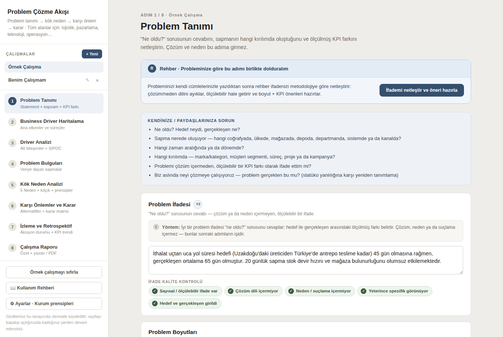
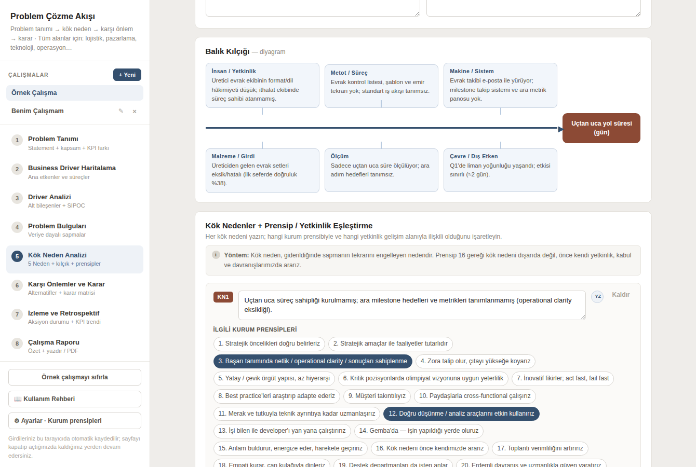
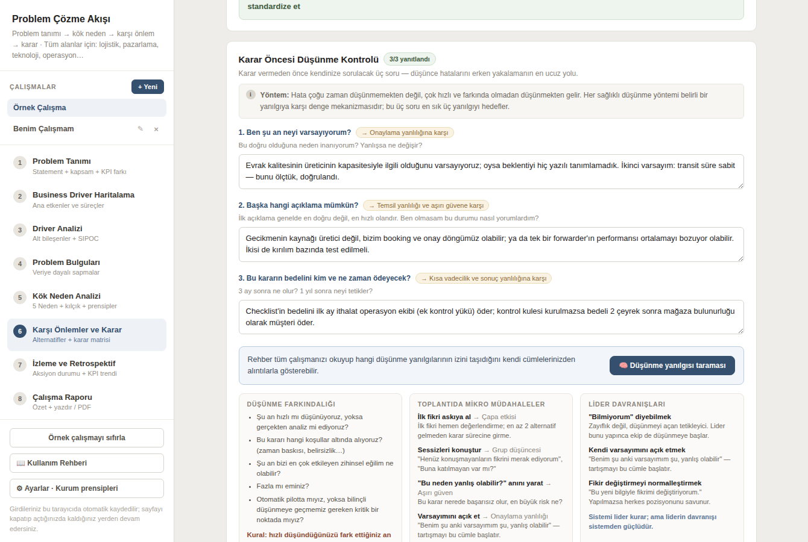
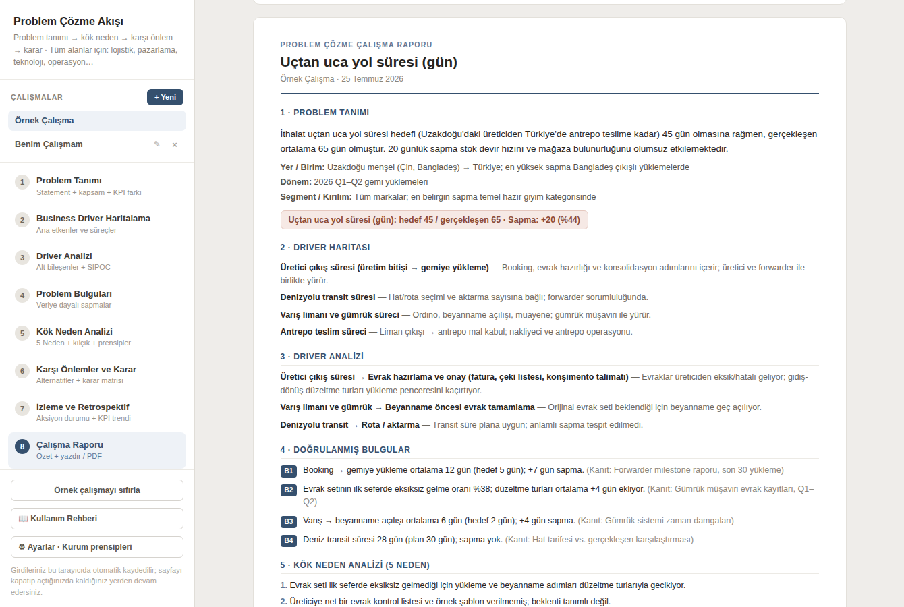

# Problem Çözme Akışı

**Bir iş problemini ölçülmüş sapmadan kök nedene, karardan aksiyona kadar tek akışta çözdüren,
yapay zekâ destekli çalışma aracı.**

Amaç yalnızca bir formu doldurtmak değil; doğru düşünme tekniklerini gerçek bir problem üzerinde
uygulatmak. Araç alan bağımsızdır — lojistik, pazarlama, teknoloji, operasyon, İK, finans.
Tarayıcıdan açılır, kurulum ve kullanıcı hesabı gerektirmez; girdiler tarayıcıda saklanır.

🔗 **Canlı:** https://problem-solving-tool.netlify.app · 📖 Uygulama içinden **Kullanım Rehberi**



---

## İçindekiler

- [Ne yapar](#ne-yapar)
- [8 adımlık akış](#8-adımlık-akış)
- [Yapay zekâ katmanı](#yapay-zekâ-katmanı)
- [Düşünme yöntemleri ve bilişsel yanılgılar](#düşünme-yöntemleri-ve-bilişsel-yanılgılar)
- [Hızlı başlangıç](#hızlı-başlangıç)
- [Netlify yayını](#netlify-yayını)
- [Ayarlar](#ayarlar)
- [Mimari](#mimari)
- [Veri modeli](#veri-modeli)
- [Geliştirirken bilinmesi gerekenler](#geliştirirken-bilinmesi-gerekenler)
- [Bilinen sınırlar](#bilinen-sınırlar)

---

## Ne yapar

Kurumlarda kararlar çoğu zaman veri eksikliğinden değil **yöntem** eksikliğinden zayıflar:
problem ile bulgu, bulgu ile kök neden birbirine karışır; analiz bitmeden çözüm konuşulur;
kök neden dış paydaşta aranır. Bu araç akışı disipline eder ve her adımda doğru soruyu sordurur.

| | |
| --- | --- |
| **Metodolojik disiplin** | Problem ≠ bulgu ≠ kök neden ayrımı her adımda korunur; 1–4. adımlarda çözüm konuşulmaz. |
| **Kurum prensipleriyle entegre** | Kök nedenler, düzenlenebilir 20 kurum prensibiyle ve yetkinlik gelişim alanlarıyla eşleştirilir. |
| **YZ önerir, kullanıcı doğrular** | Rehberin ürettiği her kayıt "doğrulanmadı" rozetiyle işaretlenir; doğrulanmadan ilerlerken uyarı çıkar. |
| **Düşünme denetimi** | Düşünme yöntemi ↔ bilişsel yanılgı eşleşmesi, karar öncesi üç soru ve yanılgı taraması. |
| **Döngüyü kapatır** | Aksiyon durumu + KPI trendi; hedefe kapanmıyorsa analize geri döndürür (PDCA). |
| **Paylaşılabilir çıktı** | Tek sayfa rapor: yönetici özeti, seçilebilir bölümler, yazdır/PDF. |

Birden çok çalışma (vaka) aynı anda yürütülebilir; silinen çalışma geri alınabilir; tüm veri
JSON olarak dışa/içe aktarılabilir.

## 8 adımlık akış

| # | Adım | İçerik |
| --- | --- | --- |
| 1 | **Problem Tanımı** | Ölçülebilir ifade + boyutlar + KPI farkı; canlı kalite kontrol çipleri; referans ekleme (not/link/dosya) |
| 2 | **Business Driver Haritalama** | MECE driver listesi + otomatik çizilen driver haritası |
| 3 | **Driver Analizi** | Alt bileşen analizi + SIPOC satırları |
| 4 | **Problem Bulguları** | Ölçülmüş sapmalar + kanıt kaynağı |
| 5 | **Kök Neden Analizi** | 5 Neden zinciri, balık kılçığı (diyagramıyla), kök neden ↔ prensip ↔ yetkinlik eşleştirmesi |
| 6 | **Karşı Önlemler ve Karar** | Alternatifler (düşünme yöntemiyle), ağırlıklı karar matrisi, karar öncesi düşünme kontrolü, karar, aksiyon planı (etki/efor önceliklendirme) |
| 7 | **İzleme ve Retrospektif** | Aksiyon durumu, KPI trend grafiği, dört soruluk retrospektif |
| 8 | **Çalışma Raporu** | Yönetici özeti, tutarlılık denetimi, bölüm seçimi, yazdır/PDF |



## Yapay zekâ katmanı

Tüm akışlar `buildSystem(step, case)` sistem talimatını paylaşır: adımın odağı + çalışmanın
tamamı (JSON) + ayarlardan gelen seviye/üslup/derinlik ekleri + kullanıcı referansları +
yanılgı farkındalığı kuralı.

| Akış | Nerede | Ne yapar |
| --- | --- | --- |
| **Rehber (coach)** | Adım 1–6 | Adıma girince form boşsa kendiliğinden çalışır; katı JSON şemasıyla aday girdiler üretir, "Forma ekle" ile forma işlenir |
| **Karar önerisi** | Adım 6 | Alternatif, kriter ve matris puanlarını değerlendirip gerekçeli karar taslağı verir |
| **Aksiyon önerisi** | Adım 6 | Karara ve kök nedenlere dayalı, etki/efor puanlı aksiyonlar (B2, KN1 atıflarıyla) |
| **Yanılgı taraması** | Adım 6 | Vakayı 11 maddelik yanılgı kataloğuna karşı tarar; her tespit kullanıcının kendi cümlesinden alıntıyla kanıtlanır |
| **Tutarlılık denetimi** | Adım 8 | Problem → bulgu → kök neden → karar → aksiyon zincirinin nerede koptuğunu raporlar |
| **Yönetici özeti** | Adım 8 | Rapora 4–6 cümlelik özet ekler |
| **Asistan sohbeti** | Her adım | O adımın uzmanı rolünde serbest sohbet; alan başına `YZ` yardım düğmeleri |

**Rehberlik seviyesi** çıktının karakterini değiştirir: *Öğreten* modda YZ hiç öneri vermez,
yalnızca Sokratik sorular sorar; *Dengeli* hipotez + doğrulama soruları üretir; *Hızlandıran*
doğrudan kullanılabilir taslaklar yazar.

## Düşünme yöntemleri ve bilişsel yanılgılar

`src/lib/thinking.js`, kurum dokümanlarından türetilmiş bilgi tabanıdır: her düşünme yöntemi
belirli bir yanılgının panzehiridir.

| Düşünme yöntemi | Karşı çalıştığı yanılgı |
| --- | --- |
| Eleştirel düşünce | Onaylama yanlılığı |
| İlk ilkeler düşüncesi | Statüko yanlılığı & batık maliyet |
| Tasarım odaklı düşünce | Temsil yanlılığı |
| Yanal düşünce | Aşırı güven yanlılığı |
| İkinci düzey düşünce | Kısa vadecilik & sonuç yanlılığı |
| Sistem düşüncesi | Mevcudiyet yanlılığı & aşırı basitleştirme |
| Algoritmik düşünce | Çapa etkisi & sezgisel kısayollar |

Uygulamadaki karşılıkları: alternatife yöntem seçilince o yöntemin **5 ekip sorusu** açılır;
Adım 6'daki **Karar Öncesi Düşünme Kontrolü** üç soruyu sordurur (neyi varsayıyorum / başka
hangi açıklama mümkün / bedelini kim ve ne zaman ödeyecek), yanılgı taramasını çalıştırır ve
düşünme farkındalığı + toplantı mikro müdahaleleri + lider davranışlarını hatırlatır. Günlük
alışkanlıklar ilgili adımlara soru olarak gömülüdür (Adım 1 problemi yeniden tanımlama,
Adım 4 "bence" yerine ölçülen veri, Adım 7 karar sonrası refleksiyon).



## Hızlı başlangıç

```bash
npm install
npm run dev        # http://localhost:5173
npm run build      # dist/
npm run preview    # üretim çıktısını yerelde dener
```

> `npm run dev` ile "Otomatik" YZ modu çalışmaz (Netlify uçları yok). Yerelde denemek için
> `netlify dev` kullanın ya da Ayarlar → YZ Sağlayıcı'dan kendi API anahtarınızı girin.

Gereksinim: Node 18+.

## Netlify yayını

`netlify.toml` hazırdır: `npm run build` → `dist` yayınlanır, `netlify/functions` ve
`netlify/edge-functions` otomatik kurulur.

| Ortam değişkeni | Zorunlu | Açıklama |
| --- | --- | --- |
| `MINIMAX_API_KEY` | evet | "Otomatik" modda kullanılan anahtar; tarayıcıya hiç inmez |
| `MINIMAX_MODEL` | hayır | varsayılan `MiniMax-Text-01` |
| `MINIMAX_BASE_URL` | hayır | varsayılan MiniMax chat/completions ucu |

Sunucu uçları:

- **`netlify/edge-functions/ai.js` → `/api/ai`** — asıl köprü. Sağlayıcıyı `stream: true` ile
  çağırıp SSE akışını olduğu gibi iletir; ilk bayt saniyeler içinde gittiği için serverless
  fonksiyonların 10 sn'lik senkron sınırı devreye girmez.
- **`netlify/functions/ai.js`** — akışsız yedek köprü. İstemci önce `/api/ai`'yi dener,
  ulaşılamazsa buraya düşer. Sağlayıcıyı 9 sn'de keserek gövdesiz 502 yerine anlaşılır bir
  504 mesajı döndürür.
- **`netlify/functions/fetch-ref.js`** — referans linki okuyucu (SSRF korumalı, 8 sn timeout,
  ilk 20.000 karakter).

## Ayarlar

Kenar çubuğundaki **⚙ Ayarlar** panelinden:

- **YZ sağlayıcı** — `Otomatik` (sunucudaki anahtar) · `MiniMax` · `OpenAI` · `Anthropic` ·
  **`Özel / Yerel`**: OpenAI uyumlu herhangi bir uç nokta. Hazır profiller: OpenRouter, Ollama,
  LM Studio, Azure OpenAI. Kimlik başlığı adı/ön eki ve ek başlıklar ayarlanabilir; anahtar boşsa
  hiç yetki başlığı gönderilmez (yerel sunucular). *Uç noktanın CORS izni vermesi gerekir;
  Ollama için `OLLAMA_ORIGINS=*`.*
- **Model üretim ayarları** — model adı (Otomatik modda da geçerli), **analiz derinliği**
  (standart / geniş / derin → token bütçesini ×1, ×1,6, ×2,5 ölçekler ve prompt'a derinlik
  kuralı ekler), **yaratıcılık** (temperature) ve `top_p`.
- **Rehber ayarları** — rehberlik seviyesi, otomatik öneri, alan/sektör bağlamı, yanıt uzunluğu,
  ton, eleştirellik.
- **Kurum prensipleri** — 20 varsayılan prensip düzenlenebilir/silinebilir; kök neden
  eşleştirmeleri prensip silindiğinde otomatik güncellenir.
- **Veri yedekleme** — tüm çalışmaları JSON dışa/içe aktarma.

> Kendi API anahtarınız yalnızca tarayıcınızda saklanır ve doğrudan seçtiğiniz sağlayıcıya
> gider; hiçbir sunucuda tutulmaz. Abonelik hesapları (Claude Pro/Max, ChatGPT Plus) üçüncü
> taraf uygulamalara açılmadığı için desteklenmez.

## Mimari

React 18 + Vite. Durum yönetimi tek bir Context store'da; harici state kütüphanesi yok.

```
src/
  App.jsx                  sayfa iskeleti, adım geçişleri, doğrulama uyarıları
  lib/
    store.jsx              tek state ağacı + localStorage + tüm YZ akışları (Context)
    ai.js                  sağlayıcı katmanı (complete) + sistem talimatı ve görev şemaları
    thinking.js            düşünme yöntemi ↔ yanılgı bilgi tabanı, soru setleri
    defaults.js            kurum prensipleri, boş/örnek çalışma, adım metinleri
    derive.js              KPI farkı, ifade kalite kontrolü, karar matrisi, trend, driver haritası
  components/              Sidebar · CoachPanel · AssistantChat · SettingsModal · ThinkingCheck
  steps/                   Step1…Step8
  ui/primitives.jsx        tasarım token'ları ve ortak öğeler (hover/focus davranışı dahil)
public/rehber.html         yazdırılabilir kullanım rehberi (A4)
netlify/                   edge-functions/ai.js · functions/ai.js · functions/fetch-ref.js
docs/screenshots/          README görselleri
project/ · chats/          kaynak prototip ve tasarım oturumu dökümleri (referans)
```

Stil, prototipteki inline stillerle birebir taşınmıştır; `ui/primitives.jsx` içindeki `S`
nesnesi tasarım token'larını (kart, girdi, düğme, rozet) tek yerde tutar. Hover davranışı
`HButton`/`HA`/`HDiv` bileşenlerinde, focus davranışı `index.css`'teki `.pcx-field`
sınıflarındadır.

## Veri modeli

Tüm durum tek ağaçta tutulur ve her değişimde `localStorage` anahtarı **`pcx_workbook_v1`**
altına yazılır (prototiple aynı şema — eski kullanıcı verisi olduğu gibi açılır).

```
{ activeCase, step (1-8), trash{key,data,name}|null,
  principles: string[],
  reportCfg: { company, sections{tanim,driver,analiz,bulgu,kok,karar,izleme,dusunme,referans} },
  aiSettings: { provider:'auto'|'minimax'|'openai'|'anthropic'|'ozel',
                apiKey, model, baseUrl, headerName, headerPrefix, extraHeaders,
                level:'ogreten'|'dengeli'|'hizli', auto, context,
                length, tone, critic, temperature, topP,
                depth:'standart'|'genis'|'derin' },
  cases: { <id>: CASE } }

CASE = { name, problem{statement,geo,time,brand,kpiName,target,actual},
  drivers[{name,note,src?,verified?}], driverAnalysis[…], sipoc[{s,i,p,o,c}],
  findings[{text,evidence,…}], whys[5], fishbone{insan,metot,sistem,girdi,olcum,cevre},
  rootCauses[{text,principles[int],competency,…}], alternatives[{name,method,note}],
  criteria[{name,weight}], scores{'ai_ci':val}, decision{choice,rationale},
  thinking{assume,alt,cost}, actions[{text,owner,due,etki,efor,status}],
  tracking[{label,value}], retro{valid,worked,process,lessons},
  references[{id,title,type,url,text,summary,…}],
  ai{step:[msg]}, coach{step:{status,intro,items,questions}},
  decisionCoach{…}, actionCoach{…}, biasScan{…}, audit{…}, report{…} }
```

Kurallar: `ornek` vakası silinemez (yalnız sıfırlanır); silinen vaka `trash`e alınır ve
"Geri al" ile kurtarılır; problem ifadesi boşken sonraki adıma geçilemez; rehberden eklenen
kayıtlar `src:'yz', verified:false` ile işaretlenir.



## Geliştirirken bilinmesi gerekenler

- **Netlify fonksiyonları ESM olmalıdır** (`export const handler = …`). Kökteki `package.json`
  `"type": "module"` olduğu için `exports.handler` kullanan bir fonksiyon Netlify'da
  `exports is not defined in ES module scope` ile çöker ve istemciye **gövdesiz 502** döner.
- **Akış birleştirme.** MiniMax delta paketlerinden sonra son pakette tüm metni tekrar
  gönderir; istemci delta gördüyse yalnız delta'ları toplar (`sawDelta`), yoksa tam metni alır.
  Aksi halde yanıt çiftlenir ve JSON ayrıştırma patlar.
- **JSON ayrıştırma toleransı.** `parseJsonReply` önce tam dilimi dener, olmazsa ilk dengeli
  `{ … }` bloğuna düşer (dizge içindeki süslü parantezleri saymaz).
- **State güncellemeleri** `stateRef` üzerinden zincirlenir; setState güncelleyicisi yan etkisizdir.
  Aynı tick içindeki ardışık `upd()` çağrıları birbirinin üzerine yazmaz.
- **Yazdırma.** Yazdırılmaması gereken her şey `data-noprint="1"` taşır; rapor dışında hiçbir
  şey çıktıya girmez.
- **Sır yönetimi.** Derleme zamanında hiçbir anahtar paketlenmez; `MINIMAX_API_KEY` yalnızca
  sunucu uçlarında okunur.

## Bilinen sınırlar

- Veri kullanıcının tarayıcısındadır — çok kullanıcılı eşzamanlı çalışma yoktur. Paylaşım
  PDF raporu ya da JSON dışa/içe aktarma ile yapılır.
- Referans dosyası olarak `.txt` / `.md` desteklenir; PDF/Word için metni kopyalayıp
  "Not ekle" ile yapıştırmak gerekir.
- Yanılgı taraması ve tutarlılık denetimi hipotez üretir; nihai değerlendirme kullanıcınındır.
- Arayüz yalnızca Türkçedir.

---

Bu depo kurum içi kullanım için hazırlanmıştır; ayrıca bir lisans tanımlanmamıştır.
